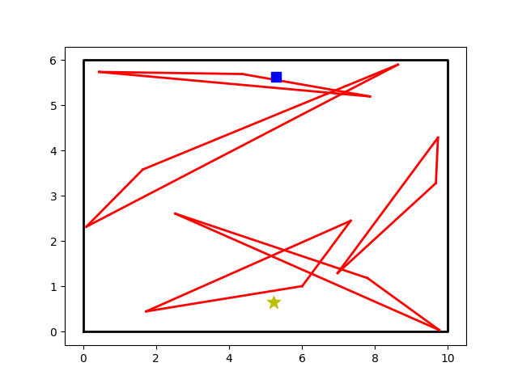
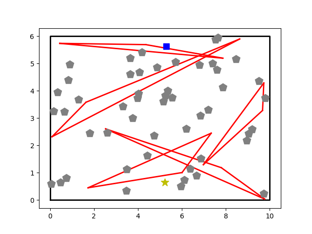
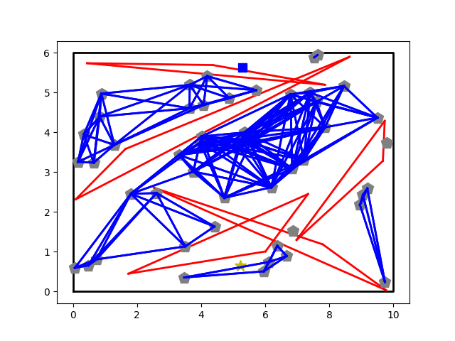
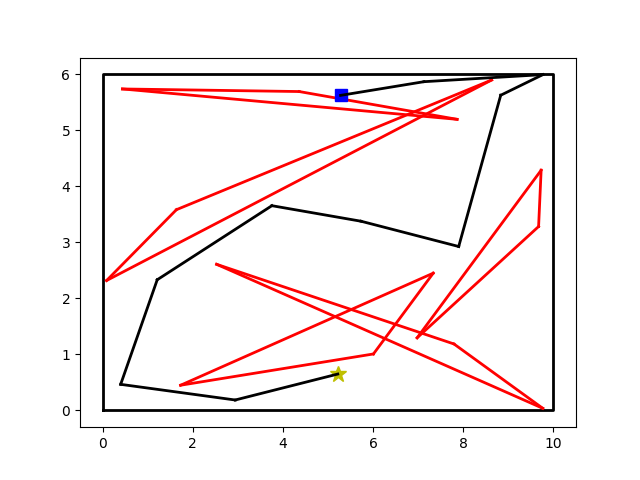
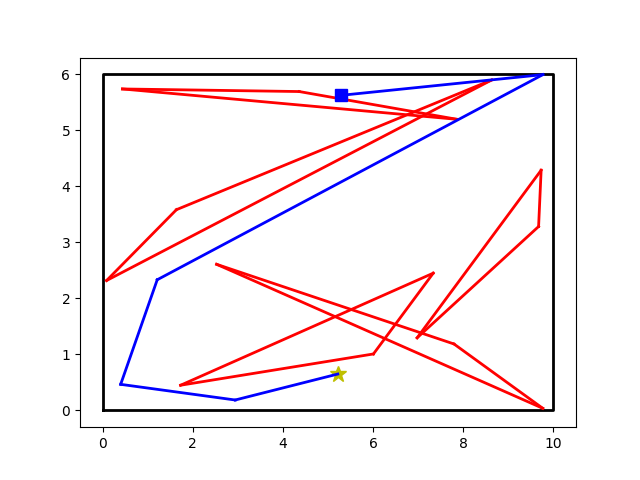
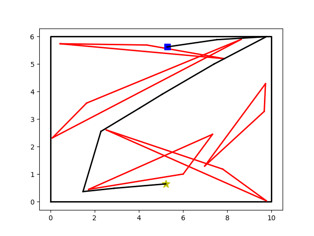
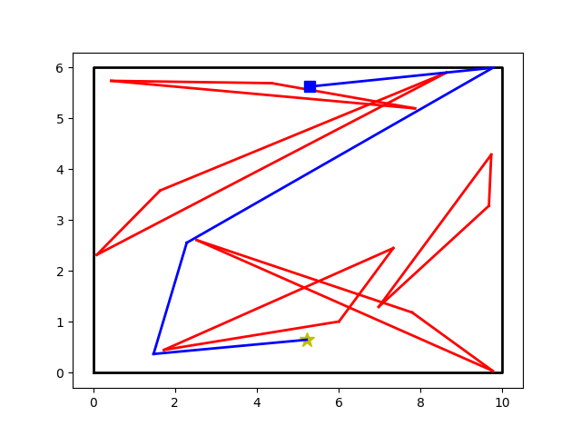

# Probabilistic Roadmap Pathfinding

This project implements a Probabilistic Roadmap (PRM) method for pathfinding in a 2D environment with obstacles. 

## How PRM Works?

The method is built around the concept of a roadmap that represents feasible paths through the environment. PRM comprises two primary stages:

1. Random Sampling: The algorithm begins by generating a set of random points or nodes throughout the environment. These nodes are strategically sampled to ensure they are located in free space, avoiding any obstacles. This process effectively captures the free, navigable space of the environment in a discrete form.

2. Roadmap Construction: Once the nodes are sampled, the algorithm proceeds to connect nodes that are within a predefined distance (neighbor radius) and the direct path between them does not intersect any obstacles. The result is a roadmap – a graph where nodes represent possible positions in the space and edges represent feasible paths.

## Implementation

1. **Environment Setup**

The program utilize the [environment_2d.py](https://github.com/uyenle-gh/osr_course_pkgs/blob/master/osr_examples/scripts/environment_2d.py) to create a 2D environment with randomly populated triangular obstacles and start and goal points. Key functions within the environment include `check_collision` and `check_edge_collision` that respectively check if a point and an edge collides with any obstacles in the environment.

2. **Random Sampling**

The `sample_free_points` function uses uniform random sampling to generate a set of random points within the environment and uses the `check_collision` function to look for possible collisions. Points that pass the collision check are added to the final list until it reaches the desired number `num_samples`.

3. **Roadmap Construction**

The `construct_init_roadmap` function takes the sampled points and neighbor radius as inputs. It examines every point if they are within the specified neighbor radius and attempts to connect them if the connection is collision-free. The result is a graph stored in a dictionary format, where each key corresponds to a free point, and its value is a list of indices representing neighboring points. It is important to note that the initial roadmap is constructed independent of the start and goal points to enhance the reusability of the roadmap for different scenarios. Subsequently, the `add_start_goal_to_roadmap` function adds the start and goal points as additional nodes and establishes connections between them and their respective neighboring points using the same criteria as for other nodes in the roadmap. The resulting graph effectively captures the navigable space of the environment and serves as the basis for the next phase.

4. **Pathfinding**

This phase leverages path search algorithms to determine the most efficient route from the start to the goal point based on the previously constructed roadmap:

- **Dijsktra's algorithm:** The algorithm works by iteratively visiting the nearest unvisited node from the starting node, calculating the tentative distances to its neighbors, and updating these distances if a shorter path is found. Conceptually, it expands outward from the start node, exploring nodes in order of increasing distance from the start. Dijsktra uses a priority queue to efficiently select the node with the smallest known distance at each step. Once a node is visited and its minimum distance from the start node is established, this value is finalized, and the node will not be revisited. The algorithm continues until all nodes have been visited or the shortest path to the target node is determined. Dijkstra's algorithm is popular thanks to its simplicity and effectiveness, but its uninformed nature can lead to less efficiency in larger or more complex graphs, as it does not prioritize nodes based on their estimated distance to the target.

- **A-star algorithm:** The algorithm improves on Dijkstra’s approach by using a heuristic (usually the Euclidean distance) to estimate the cost from a given node to the goal. This heuristic guides the search, allowing A* to explore paths that are more likely to lead quickly to the target, and thereby often finds the shortest path more efficiently than Dijkstra's Algorithm. A* maintains two costs for each node: the actual cost from the start node to the current node, and the estimated cost from the current node to the goal, provided by the heuristic. The sum of these two costs is used to prioritize nodes in the priority queue. 

5. **Post proccessing: Path shortcutting**

The path shorcutting algorithm refines and optimizes the initially found path. It works by randomly selecting two points along the path and checking if a direct, collision-free path exists between them, effectively shortening and simplifying the original path. 

## Usage

```
python probablistic_roadmap.py --size_x [WIDTH] --size_y [HEIGHT] --num_obs [OBSTACLES] --num_samples [SAMPLES] --neighbor_radius [RADIUS] --path_finder [ALGORITHM]
```

**Arguments**
* `--size_x`: Width of the environment.
* `--size_y`: Height of the environment.
* `--num_obs`: Number of obstacles.
* `--num_samples`: Number of points to sample for PRM.
* `--neighbor_radius`: Radius to connect points in the PRM.
* `--path_finder`: Choose 'Astar' or 'dijkstra' for pathfinding.

## Demo

Below is a visualization of the PRM algorithm:

Environment setup:



Random sampling:



Roadmap construction:



**Dijkstra's algorithm**

Pre-processing:



Post-processing:



**A-star algorithm**

Pre-processing:



Post-processing:

